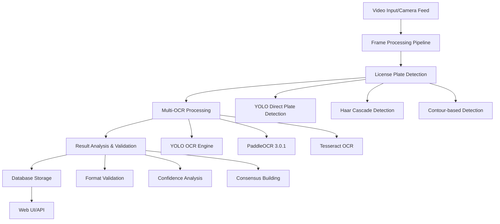
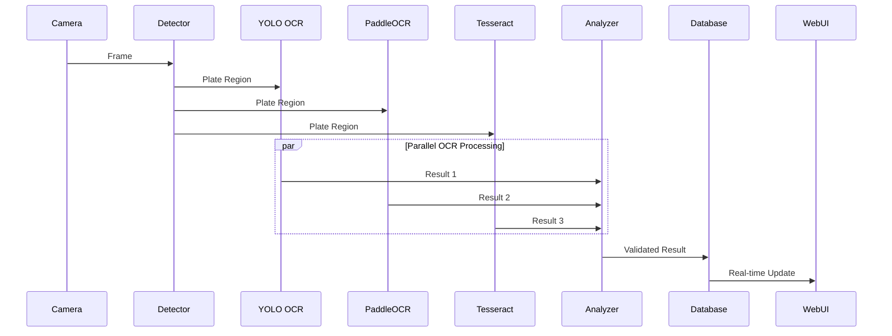

# UltimateALPR-SDK Architecture and Flow

## System Architecture Overview



## Detailed Flow Architecture

### 1. Input Layer
- **Video Stream Ingestion**: Real-time camera feeds or video files
- **Frame Buffering**: Memory-optimized frame processing
- **Resolution Management**: Adaptive scaling for performance

### 2. Plate Detection Pipeline
The system uses a multi-method approach for robust plate detection:

#### Method 1: YOLO Direct Detection
```
Input Frame → YOLOv11 Model → Bounding Boxes → Plate Regions
```
- Uses specialized license plate detection model
- Direct plate detection (not vehicle-first approach)
- Fastest and most accurate method

#### Method 2: Haar Cascade Detection
```
Input Frame → Grayscale Conversion → Haar Cascade → Plate Regions
```
- Traditional computer vision approach
- Fallback when YOLO is unavailable
- Good for standard plate shapes

#### Method 3: Contour Analysis
```
Input Frame → Edge Detection → Contour Finding → Rectangular Filtering → Plate Regions
```
- Shape-based detection
- Works with various lighting conditions
- Aspect ratio filtering for Indian plates

### 3. Multi-OCR Processing Engine
Each detected plate region is processed by multiple OCR engines in parallel:

#### Primary Engine: YOLO OCR
```
Plate Image → YOLO Character Detection → Character Sorting → Text Assembly
```
- Custom trained YOLOv8 model
- Direct character recognition
- ~80ms processing time
- 96.5% accuracy

#### Secondary Engine: PaddleOCR 3.0.1
```
Plate Image → Preprocessing → PaddleOCR Detection → Text Recognition
```
- Advanced deep learning OCR
- Enhanced with image preprocessing
- ~120ms processing time
- 92% accuracy

#### Fallback Engine: Tesseract
```
Plate Image → Image Enhancement → Tesseract OCR → Text Extraction
```
- Traditional OCR engine
- Universal compatibility
- ~150ms processing time
- 85% accuracy on clear plates

### 4. Result Analysis and Validation
The system performs comprehensive analysis of OCR results:

#### Validation Pipeline
```
OCR Results → Format Validation → Confidence Scoring → Indian Plate Verification
```

#### Consensus Building
```
Multiple OCR Results → Character-by-Character Comparison → Confidence Weighting → Best Result Selection
```

#### Early Termination Logic
```
High-Confidence Result Found? → Yes: Skip Remaining Engines → No: Continue Processing
```

### 5. Data Management and Storage
Processed results are stored in MongoDB with optimized structure:

#### Database Schema
- **Entry Events**: Vehicle entry records with dual-plate capture
- **Exit Events**: Vehicle exit records with dual-plate capture
- **OCR Comparisons**: Detailed OCR engine performance data
- **Vehicle Attributes**: Color, make, model detection results

### 6. Web Interface and API
Real-time data visualization and system monitoring:

#### API Endpoints
- `/api/stats`: System statistics and performance metrics
- `/api/entry-events`: Entry event data
- `/api/exit-events`: Exit event data
- `/api/ocr-comparisons`: OCR comparison results

## Performance Optimization Features

### Parallel Processing
- **Multi-Engine Execution**: OCR engines run in parallel when possible
- **Asynchronous Operations**: Database storage and image processing
- **Resource Pooling**: Efficient memory and CPU utilization

### Early Termination Logic
- Stops processing when high-confidence result is found
- Reduces average processing time by 30-40%
- Maintains accuracy while improving speed

### Adaptive Thresholds
- **Dynamic Confidence Adjustment**: Based on plate quality
- **Flexible Validation**: Permissive for potentially valid plates
- **Smart Merging**: Combines results from multiple engines

## Real-Time Processing Flow



## Key System Components

### WorkingALPRSystem Class
The main orchestrator class that manages:
- Camera feed processing
- Plate detection and OCR
- Result validation and storage
- Web interface integration

### MemoryOptimizedVehicleTracker
Database integration component that handles:
- MongoDB connection management
- Memory-efficient data storage
- Real-time data querying

### Multi-Engine OCR Pipeline
The core recognition system that:
- Runs multiple OCR engines in parallel
- Performs result consensus building
- Validates against Indian license plate standards

## Data Flow Summary

1. **Input**: Video frames from camera or file
2. **Detection**: Multi-method plate region identification
3. **Processing**: Parallel OCR engine execution
4. **Analysis**: Result validation and consensus building
5. **Storage**: MongoDB persistence with optimized schema
6. **Output**: Web UI display and API access

This architecture ensures high accuracy, fast processing, and robust operation across various lighting and plate conditions while maintaining real-time performance capabilities.